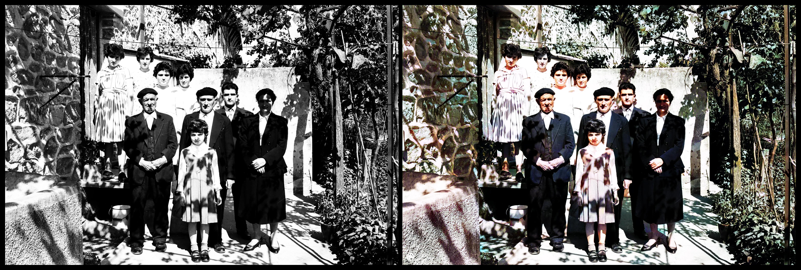
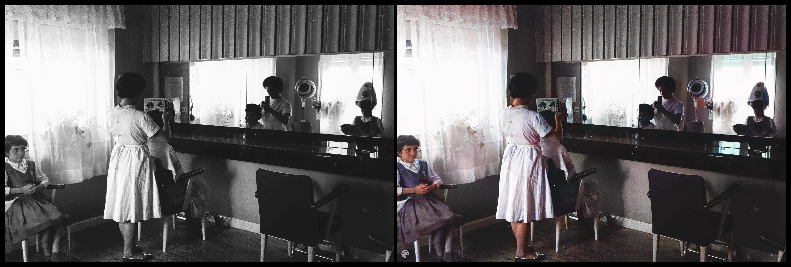
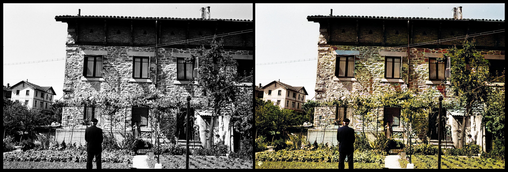
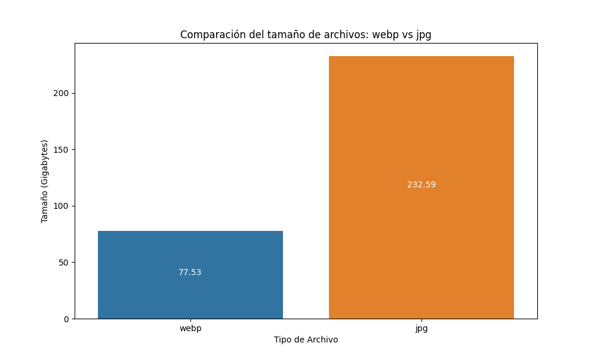

# Un experimento con los archivos fotográficos públicos

**Retrogasteiz** es un experimento personal de [Iker Ocio Zuazo](https://ikerocio.com), (inspirado en el trabajo de [Jaime Gómez-Obregón](https://twitter.com/JaimeObregon) como autor original) con las más de 100.000 imágenes del Archivo de Álava, digitalizado por la Diputación Foral de Álava - Araba Foru Aldundia y publicado con licencia abierta [CC BY-NC-SA 4.0](https://creativecommons.org/licenses/by-nc-sa/4.0/deed.es) por la misma Diputación en [https://photo.araba.eus](https://photo.araba.eus).

Con ello, pretendo explorar **otras formas de poner en valor un archivo fotográfico público**, aplicando ideas como la visión artificial o las interfaces de usuario modernas.

**Retrogasteiz** es también una demostración de cómo **la difusión abierta** de las bases de datos públicas permite a la ciudadanía construir iniciativas nuevas y compartidas con todos.

# Retrogasteiz

He creado el proyecto Retrogasteiz con el objetivo de brindar a todos un acceso rápido, sencillo y eficiente al archivo fotográfico de Álava. Este proyecto pone de relieve los archivos fotográficos y las historias contadas tras los pixeles de cada imágen donde éstas son las protagonistas.

Debo dar las gracias a la Diputación Foral de Álava por proveer todas las imágenes con licencia [CC BY-NC-SA 4.0](https://creativecommons.org/licenses/by-nc-sa/4.0/deed.es), ya que sin ello esta plataforma no podría existir.

Todas las imágenes cuentan con un hipervinculo donde encontrar la fuente original de la imágen en [https://photo.araba.eus](https://photo.araba.eus).

[]()

Este proyecto a nacido a partir del [siguiente proyecto](https://github.com/JaimeObregon/retrosantander) desarrollado por [Jaime Gómez-Obregón](https://twitter.com/JaimeObregon) que ha dado a luz a:

- [retrosantander.com](https://retrosantander.com)
- [retrogipuzkoa.com](https://retrogipuzkoa.com)
- [guregipuzkoa.com](https://guregipuzkoa.com)

# Características y limitaciones

1. **Búsqueda instantánea**. A diferencia de la mayoría de los archivos, las búsquedas no se cursan en el servidor sino directamente en el navegador del usuario. Para este fin se envía el índice completo de las colecciones fotográficas al navegador del usuario. Así se pueden obtener resultados instantáneos de las búsquedas al tiempo que se teclea. Esto impone la limitación de que no se pueda buscar en todas las colecciones simultáneamente.

2. **Visión artificial**. He pasado las fotografías de los archivos por el servicio Amazon Rekognition, de visión artificial. Los ficheros JSON resultantes están alojados en el subdirectorio `details` de cada proyecto, y son requeridos por la interfaz de usuario cuando este amplía una fotografía.

3. **Coloreado artificial**. Las imágenes han sido coloreadas por una inteligencia artificial llamada [DeOldify](https://github.com/jantic/DeOldify). Todos los coloreados han sido computerizados de forma local para servir la versión coloreada al vuelo.







# Arquitectura

Este repositorio es multiproyecto, basado en el proyecto original de Jaime pero actualmente solo ocupa un único proyecto:

1. **Retrogasteiz**, desplegado en [retrogasteiz.com](https://retrogasteiz.com).

La arquitectura de la aplicación, por lo tanto, pretende servir a múltiples archivos fotográficos desde una misma base de código común y extensible.

El programa determina qué proyecto servir en función del nombre del _host_. Para desarrollar en local es preciso, por lo tanto, añadir las entradas necesarias a `/etc/hosts`. Por ejemplo:

```
127.0.0.1 retrogasteiz retrosantander retrogipuzkoa guregipuzkoa
```

Para iniciar el entorno de desarrollo basta instalar las dependencias y arrancar el servidor web invocando el script de `package.json` correspondiente al proyecto que se desea servir:

```console
npm install
npm run retrogasteiz
```

La variable de entorno `$PROJECT` determina qué proyecto se servirá.

El _stack_ tecnológico es deliberadamente minimalista y está basada en estándares W3C: _web components_, _shadow DOM_, HTML5, CSS y JavaScript (ES6). Parte del reto ha sido elaborar complementamente a medida todos los componentes, de forma que no hay dependencias externas, ni tampoco un _backend_ o una base de datos.

# Integración con Visual Studio Code (VS Code)

El directorio `.vscode` aporta configuración para VS Code, incluyendo la definición de las tareas para arrancar los proyectos. Una de las tareas corre automáticamente al abrir VS Code, arrancando el servidor web de desarrollo con un proyecto.

# Estilo de código

El código se adhiere al formato conferido por [Prettier](https://prettier.io) con los mínimos ajustes configurados en la clave `prettier` del fichero `package.json`.

# Despliegue

Con cada _push_ a la rama _develop_ se lanza el despliegue del proyecto en [retrogasteiz.com](https://retrogasteiz.com).

# Alojamiento de los archivos

- **Retrogasteiz**. La colección de imágenes que se puede explorar desde Retrogasteiz se encuentra alojada en Azure Blob Storage. Inicialmente, todos los archivos se servían en formatos jpg/png, pero han sido convertidos a webp para disminuir en más de un tercio el tamaño de cada archivo. Esto conlleva varios beneficios: acelera las descargas, optimiza la experiencia del usuario, minimiza el volumen de datos necesarios para explorar el sitio web y contribuye a una mayor sostenibilidad ambiental.

* Total GB en formato jpg: **232.59GB**
* Total GB en formato webp: **77.53GB**



# Almacenamiento y visión artificial

Para el almacenamiento y distribución del archivo fotográfico de RetroGasteiz, hago uso de Azure Blob Storage. En lo que respecta al servicio de visión artificial, opté por Amazon Rekognition de AWS. Esto se debe a que Azure ha decidido interrumpir la oferta de estos servicios para mitigar el riesgo de malas prácticas, tal como se detalla en este [artículo](https://azure.microsoft.com/es-es/blog/responsible-ai-investments-and-safeguards-for-facial-recognition/).

Este repositorio no incluye el _script_ necesario para descargar las fotografías y metadatos del portal de retrogasteiz.com.

# Licencia

Este proyecto es software libre y se distribuye bajo la licencia GNU AFFERO GENERAL PUBLIC LICENSE versión 3.

Esto significa que puedes utilizar este programa para usos personales o comerciales, modificarlo a tu gusto y distribuirlo libremente. Pero al hacerlo tú también debes publicar el código fuente con tus aportaciones, distribuirlo bajo la misma licencia y preservar la información sobre la autoría original.

Para esto último debes mantener en tu sitio web, en un lugar discreto pero visible, una mención a Jaime Gómez-Obregón como autor original y un enlace a `https://github.com/JaimeObregon/retrosantander/`.

Si deseas que sea yo mismo quien adapte este programa al archivo fotográfico de tu entidad, quizá puedas contratarme: [https://twitter.com/JaimeObregon](https://twitter.com/JaimeObregon).
